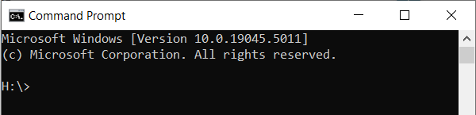
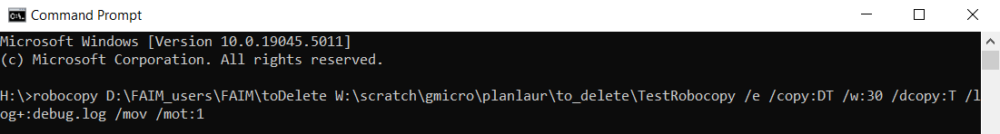

# Robocopy Command Builder
Microscopy data needs to be saved locally to prevent any interruptions or data loss during acquisition. However, as the local drives have limited capacity, especially for large experiments (such as over the weekend time-lapse for example), we need to transfer files to network storage and delete the local files during the acquisition.

We recommend using Robocopy to facilitate the parallel transfer of data and deletion of local files in real-time. Here's how.

1. Start Windows Command prompt.
    <figure markdown="span">
        
        <figcaption>Command Prompt window</figcaption>
    </figure>
2. Prepare your command:<br/>
   {{{user-defined-values}}}<br/>
    ```bash
    robocopy SOURCE DESTINATION /e /copy:DT /w:30 /dcopy:T /log+:debug.log /mov /mot:MINUTES
    ```
3. Enter the line to Command Prompt and press “enter” to start the process.
    <figure markdown="span">
        
        <figcaption>Example of a Robocopy command line that will transfer files from a local D: drive to the W: drive</figcaption>
    </figure>

4. Let it run until the end of your experiment.
5. To stop the process, you can just close down the command prompt.
